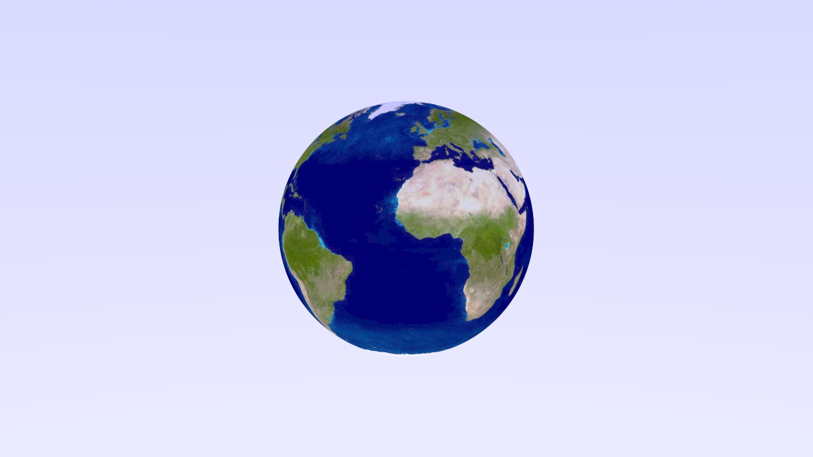
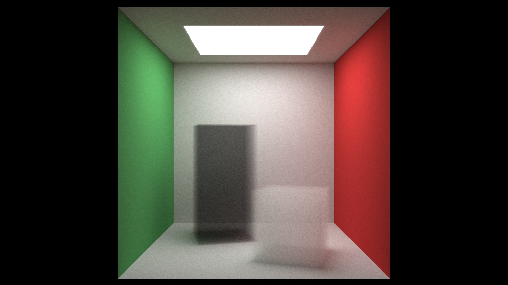
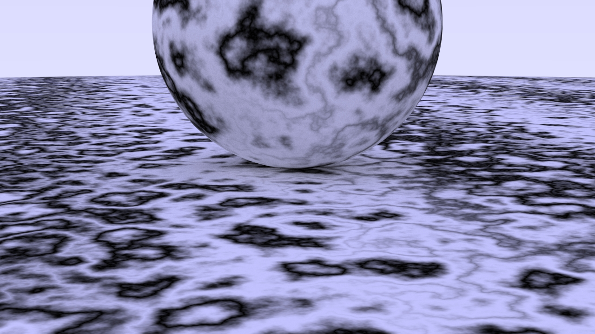
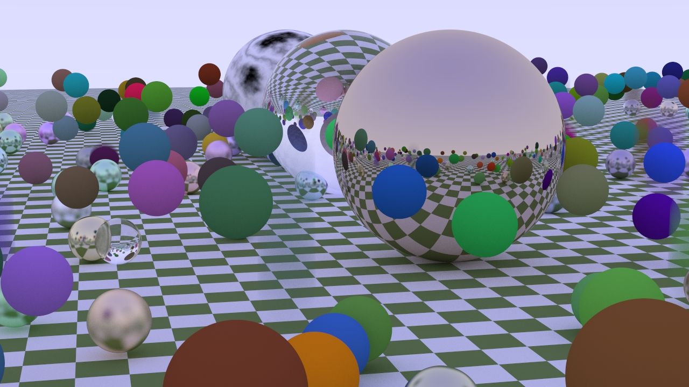

[](https://circleci.com/gh/strohs/raytracer)

# Rust Raytracer
A Rust implementation of the software ray-tracer from the first two books of [Ray Tracing in One Weekend](https://raytracing.github.io/)

This implementation of the raytracer adds multi-threaded rendering, plus the ability to render one of the six sample scenes described in the book.

The final rendered images are saved in the [ppm](http://ailab.eecs.wsu.edu/wise/P1/PPM.html) image format. Most modern image viewing programs 
should be able to display .ppm image files. 
On my linux system I used [feh](https://feh.finalrewind.org/)

## Sample Scenes
Here are the sample scenes from the book that can be generated using this raytracer.

They are rendered at 1280x720 with samples per pixel set to 5000.

#### Final Scene from Book Two


#### Cornell Box


#### Textured Earth Sphere




#### Cornell Box with smoke




#### Perlin Spheres




#### Random spheres




## Building
use `cargo build --release` to build the raytracer executable

## Running
run the raytracer executable from the command line without any options:
> raytracer

this will generate the default scene: Cornell Box, with default settings of: width=1024 pixels, 
aspect ratio=1.77 (16:9), and samples per pixel = 500
The final image will be saved in the same directory that you invoked the raytracer from as a **.ppm** image


to get command line help:
> raytracer -h


### Examples
to generate the final scene from the second book with a width of 1280 pixels, and a 4:3 aspect ratio:
> raytracer -w 1280 -a 1.33 -s 6                                                                                     

to generate a quick preview of the same scene, set the samples per pixel to 1
> raytracer -w 1280 -a 1.33 -s -p 1

to generate the same scene with increased image quality (set samples per pixel to 5000)
> raytracer -w 1280 -a 1.33 -p 5000 -s 6

higher samples per pixel values will increase the render time. On a 4-core Intel 4770k running at 4.3GHz 
the total render time was 38 minutes.
  

The following command line options are supported: `raytracer -h`:
```
raytracer [-w WIDTH] [-p SAMPLES_PER_PIXEL] [-a ASPECT_RATIO] [-s SCENE_NUMBER]

WIDTH = width of the rendered image, defaults to 1024
SAMPLES_PER_PIXEL = number of multisamples to take for each pixel. Defaults to 500. Setting this to higher values
                    will improve image quality and increases render time.
ASPECT_RATIO = should be a floating point number >= 1.0. Defaults to 1.77  Some examples:
               1.77 = a 16:9 aspect ratio
               1.6  = a 16:10 aspect ratio
               1.33 = a 4:3 apect ratio
               1.43 = IMAX film format
               1.85 = U.S. widescreen cinema format
SCENE_NUMBER = integer between 1 - 6. let's you pick a pre-made scene from the book to render. Defaults to 6
               1 = Random Spheres
               2 = Two Perlin Spheres
               3 = Texture mapped Earth
               4 = Cornell Box
               5 = Cornell Box with smoky primitives
               6 = Final Scene (random boxes, spheres, lit by a single light)
```